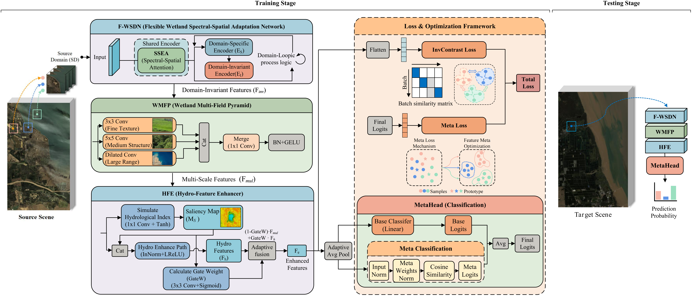

## Hydrology-Aware Contrastive Meta-Learning for Domain Generalization Hyperspectral Wetland Image Classification

<p align='center'>
  
</p>

## Abstract

Wetlands represent vital ecosystems requiring precise monitoring for conservation, with hyperspectral imaging serving as a crucial remote sensing technology. However, hyperspectral wetland image classification faces significant challenges in domain generalization due to spectral shifts across geographical regions, seasons, and sensors. This necessitates models trained solely on source domains that generalize to unseen target domains without retraining. To address this, we propose HydroMetaNet, a hydrology-aware contrastive meta-learning framework for domain-generalized wetland classification. Our approach incorporates a flexible wetland spectral-spatial adaptation network to handle spectral variability, a multi-scale feature pyramid capturing hierarchical wetland structures, and a hydro-feature enhancer exploiting hydrological characteristics. We further develop an invariant contrastive loss strategy with structured negative mining and prototype-anchored meta-classification. Evaluated extensively across three cross-domain wetland benchmarks with varied geographical, seasonal, and sensor-based shifts, HydroMetaNet consistently achieves state-of-the-art performance, demonstrating significant OA improvements of 7.19\% (78.83\% vs. 71.64\%) in cross-region, 1.62\% (83.57\% vs. 81.95\%) in seasonal, and 0.79\% (73.95\% vs. 73.16\%) in cross-sensor generalization tasks compared to the best baselines. The framework exhibits exceptional capability in minority class discrimination while maintaining leading average accuracy and Kappa metrics across all scenarios.

## Paper

Please cite our paper if you find the code or dataset useful for your research.

```
@ARTICLE

```


## Requirements

CUDA Version: 11.7

torch: 2.0.0

Python: 3.10

## Dataset

The dataset directory should look like this:

```bash
datasets
├── Wetland
│   ├── ZY_HHK_data108_20200628.mat
│   ├── ZY_HHK_gt108_20200628.mat
│   ├── ZY_HHK_data108_20210929.mat
│   └── ZY_HHK_gt108_20210929.mat
```

## Usageetland

1.You can download dataset here.

2.You can change the `source_name` and `target_name` in train.py to set different transfer tasks.

3.Run the following command:

dataset1:
```
python train_OnlyD_deepseek.py --data_path ./datasets/Wetland/ --source_name ZY1-02D_HHK_2020 --target_name ZY1-02D_Yancheng_A --re_ratio 1 --max_epoch 50 --log_interval 5 --training_sample_ratio  0.8 --batch_size 256 --seed 233
```
dataset2:
```
python train_OnlyD_deepseek.py --data_path ./datasets/Wetland/ --source_name HHK_20200628 --target_name HHK_20210929 --re_ratio 1 --max_epoch 50 --log_interval 5  --training_sample_ratio 0.8 --batch_size 256 --seed 233
```
dataset3:
```
python train_OnlyD_deepseek.py --data_path ./datasets/Wetland/ --source_name ZY1-02D_Yancheng_B --target_name GF5_Yancheng --re_ratio 1 --max_epoch 50 --log_interval 5 --dim 512 --training_sample_ratio 0.8 --seed 233 --batch_size 256 --seed 233
```

<p align='center'>
  
  
  
</p>


